# Comparative Study of Optimization Algorithms

This repository contains the code and results of a project that compares the performance of various optimization algorithms applied to two distinct problems: the Traveling Salesman Problem (TSP) and the minimization of the Rastrigin function.

The evaluated algorithms are:

- **[HC-C]** - Hill-Climbing (classic)
- **[HC-R]** - Hill-Climbing with Restart
- **[SA]** - Simulated Annealing
- **[GA]** - Genetic Algorithm

The repository includes the implemented code for each algorithm and problem, along with a report summarizing the comparative results.

 

## Problem 1: Traveling Salesman Problem (TSP)

The Traveling Salesman Problem (TSP) is a well-known optimization challenge where the objective is to determine the shortest possible route that starts at one city, visits each of a given set of cities exactly once, and returns to the starting city.

### Dataset

The Western Sahara dataset, sourced from the Concorde TSP Library ([Reference 1](#references)), was used for testing. This dataset consists of 29 cities located in the Western Sahara region, with a known optimal tour length of **27,603 units** (in an arbitrary scale). This manageable size and known optimal solution make it ideal for validating and comparing algorithm performance.

### Parameters

To ensure a fair comparison, all algorithms were configured to perform **50,000 objective function calls** per execution, with each algorithm executed **10 times**. Parameters were tuned empirically to optimize solution quality based on the number of cities.

- **General Parameters:**
  - Number of executions: 10
  - Objective function calls: 50,000

- **Hill-Climbing with Restart:**
  - Number of restarts: 5

- **Simulated Annealing:**
  - Initial acceptance probability: 1
  - Linear reduction: Probability of accepting worse solutions decreases linearly to 0 after 90% of iterations

- **Genetic Algorithm:**
  - Population size: 200
  - Elite percentage: 20%
  - Mutation probability: 20%

### Results

The table below summarizes the performance of each algorithm over 10 executions, reporting the maximum, minimum, median, and standard deviation of the tour costs:

| Algorithm | Max    | Min    | Median | Standard Deviation |
|-----------|--------|--------|--------|--------------------|
| HC        | 45,577 | 31,484 | 36,668 | 5,227              |
| HC-R      | 35,727 | 29,663 | 32,020 | 1,746              |
| SA        | 38,593 | 28,697 | 34,604 | 3,512              |
| GA        | 30,636 | 27,601 | 28,876 | 919                |

Table 1: Summary of Results

  

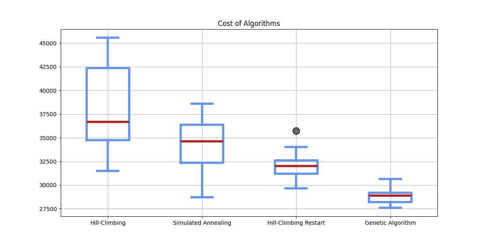

Figure 1: Final costs after 10 executions of the algorithms

  

- **Observations:**
  - The **Genetic Algorithm (GA)** achieved the best performance, with a median cost of **28,876** and a minimum cost of **27,601**, very close to the optimal solution. Its low standard deviation (919) indicates high consistency.
  - The **classic Hill-Climbing (HC)** performed the worst, with a median cost of **36,668**, frequently getting trapped in local minima due to its lack of mechanisms to escape suboptimal solutions.
  - **Hill-Climbing with Restart (HC-R)** and **Simulated Annealing (SA)** showed intermediate performance, improving over HC but not matching GA's effectiveness.

Visualizations of the best solutions found by each algorithm are provided below:
  

## TSP - Hill-Climbing
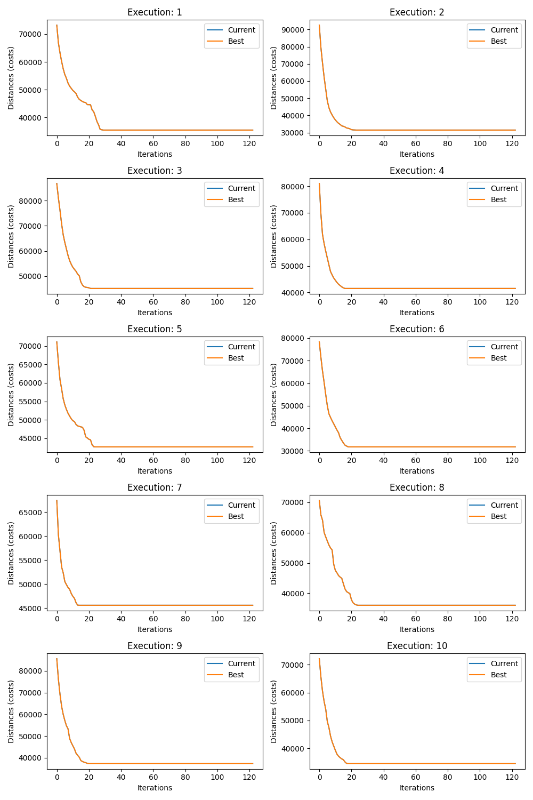

Figure 2: Hill-Climbing - Evolution of the objective function

  

## TSP - Hill-Climbing Restart
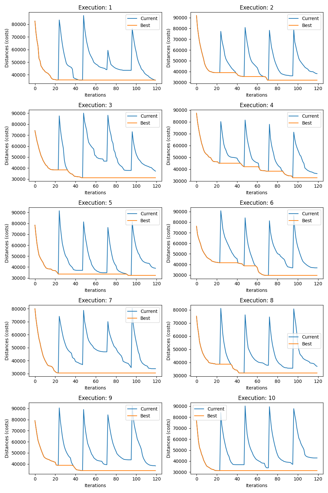

Figure 3: Hill-Climbing Restart - Evolution of the objective function

  

## TSP - Simulated Annealing
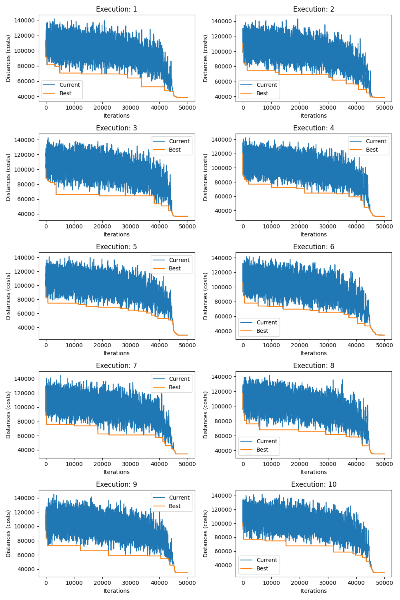

Figure 4: Simulated Annealing - Evolution of the objective function

  

## TSP - Genetic Algorithm
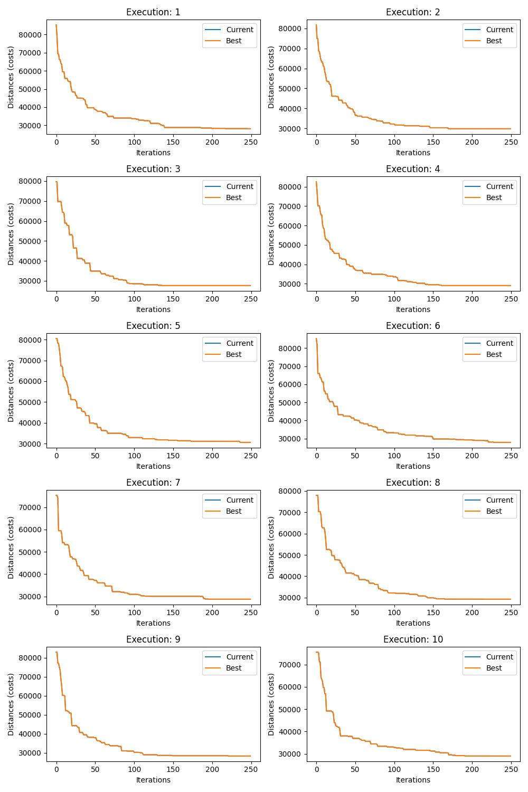

Figure 5: Genetic Algorithm - Evolution of the objective function

  

## TSP - Visualization of the Best Solutions

The figures below present the best solutions for the Traveling Salesman Problem (TSP) for each of the tested algorithms.

### Hill Climbing
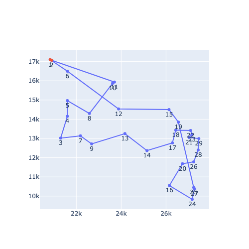

Figure 6: Hill Climbing - Best Solution

  

### Hill Climbing Restart
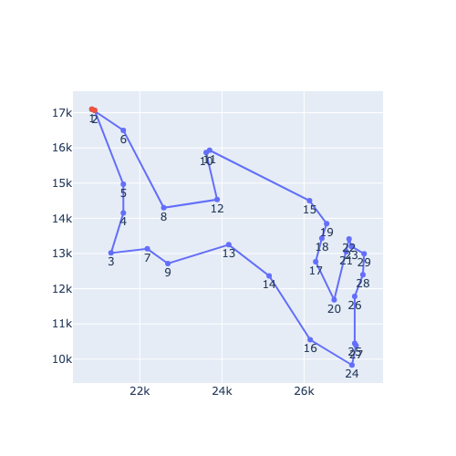

Figure 7: Hill Climbing Restart - Best Solution

  

### Simulated Annealing
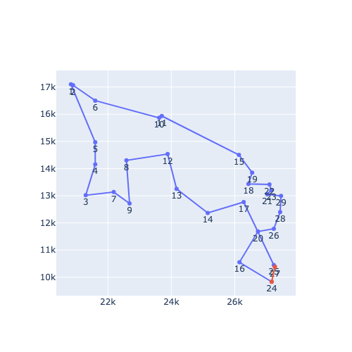

Figure 8: Simulated Annealing - Best Solution

  

### Genetic Algorithm
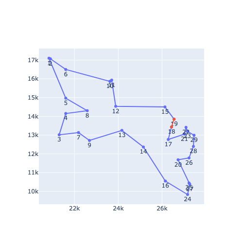

Figure 9: Genetic Algorithm - Best Solution

  

## Problem 2: Minimizing the Rastrigin Function

The Rastrigin function is a non-convex, multimodal function commonly used to evaluate optimization algorithms. It is defined as:

$$
f(x, y) = 20 + x^2 - 10 \cos(2 \pi x) + y^2 - 10 \cos(2 \pi y)
$$

The goal is to minimize this function within the interval \([-5.12, 5.12]\) for both \(x\) and \(y\), where the global minimum is **0**.

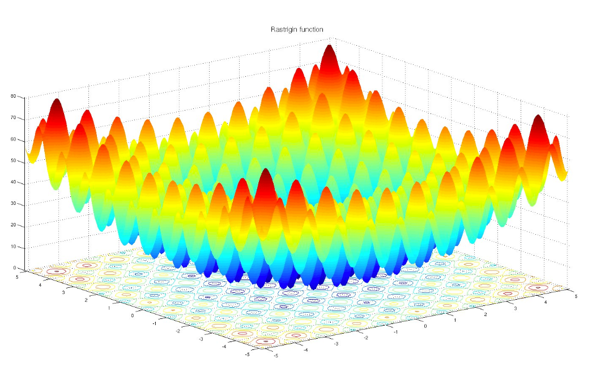
  

### Parameters

For a fair comparison, HC, HC-R, and SA performed **1,000 iterations** per execution, while GA was configured with generations. Each algorithm was executed **10 times**, with parameters tuned based on preliminary experiments.

- **General Parameters (HC, HC-R, SA):**
  - Number of iterations: 1,000

- **Hill-Climbing with Restart:**
  - Number of restarts: 20
  - Iterations per restart: 50

- **Simulated Annealing:**
  - Initial acceptance probability: 1
  - Linear reduction: Probability decreases linearly to 0 after 900 iterations

- **Genetic Algorithm:**
  - Population size: 20
  - Number of generations: 50
  - Mutation probability: 20%
  - Elite percentage: 20%

### Results

The table below summarizes the results over 10 executions:

| Algorithm | Max   | Min   | Median | Standard Deviation |
|-----------|-------|-------|--------|--------------------|
| HC        | 33.84 | 3.98  | 16.93  | 10.50              |
| HC-R      | 5.29  | 0.86  | 1.70   | 1.31               |
| SA        | 12.15 | 2.06  | 6.18   | 3.57               |
| GA        | 1.02  | 0.00  | 0.53   | 0.51               |

Table 2: Summary of Results

  

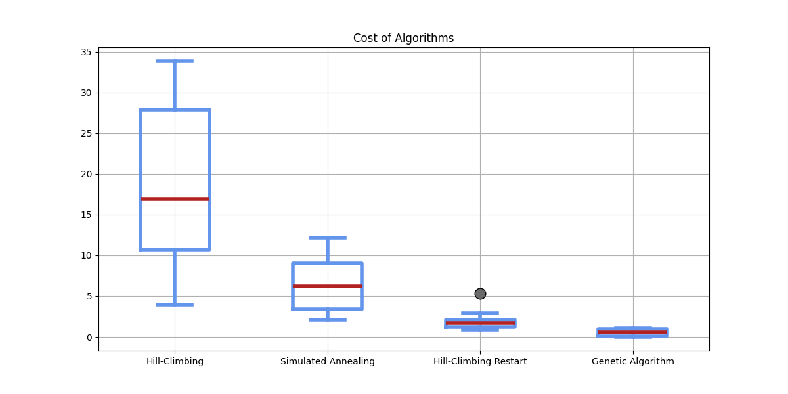

Figure 11: Final costs after 10 executions of the algorithms

  

- **Observations:**
  - The **Genetic Algorithm (GA)** outperformed others, achieving a median cost of **0.53** and reaching the global minimum (**0.00**) in at least one execution. Its low standard deviation (0.51) reflects consistent performance.
  - The **classic Hill-Climbing (HC)** had the poorest results, with a median of **16.93** and a high standard deviation (10.50), indicating instability and difficulty escaping local minima.
  - **Hill-Climbing with Restart (HC-R)** and **Simulated Annealing (SA)** performed better than HC but were less effective than GA in this multimodal landscape.

Visualizations of the best solutions found by each algorithm are provided below:
  

## Rastrigin - Hill-Climbing
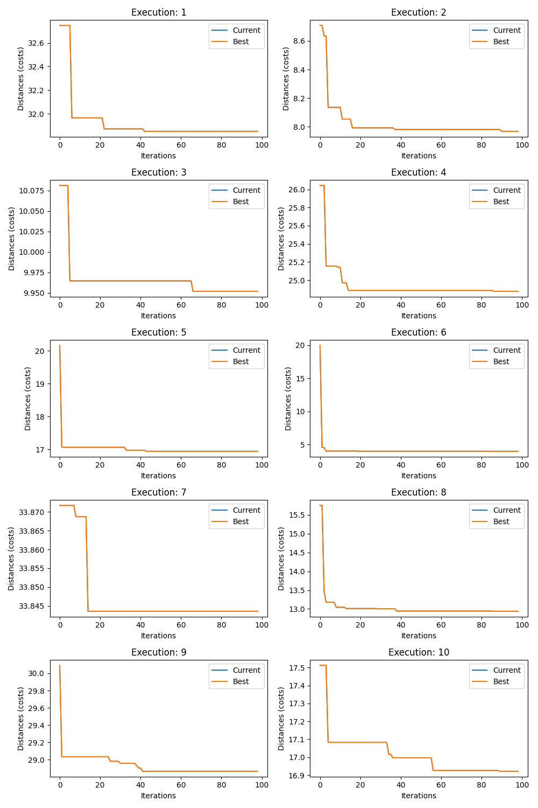

Figure 12: Hill-Climbing - Evolution of the objective function

  

## Rastrigin - Hill-Climbing Restart
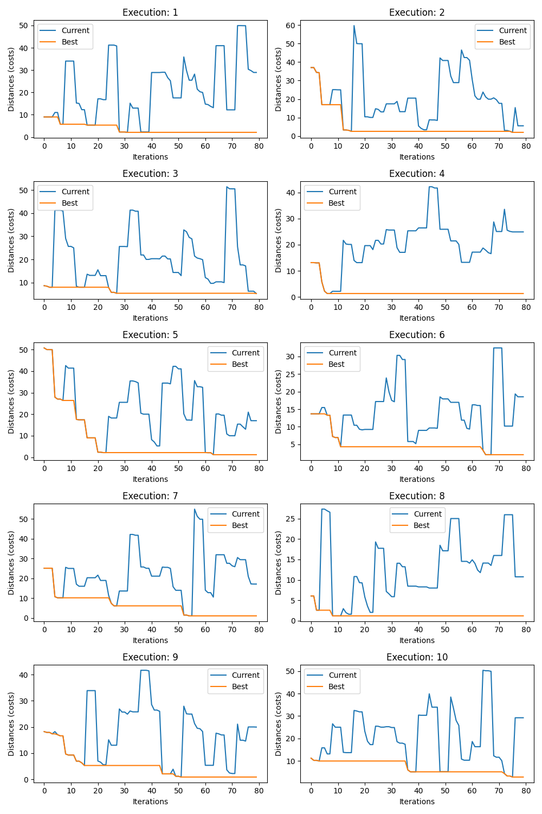

Figure 13: Hill-Climbing Restart - Evolution of the objective function

  

## Rastrigin - Simulated Annealing
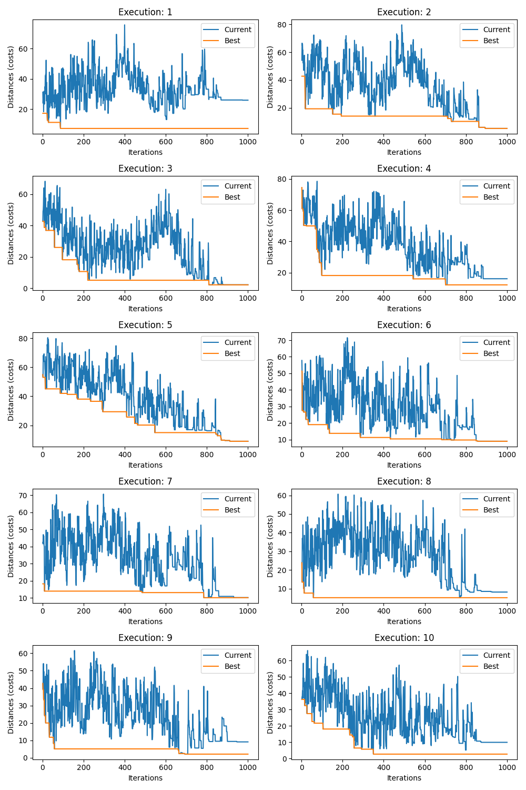

Figure 14: Simulated Annealing - Evolution of the objective function

  

## Rastrigin - Genetic Algorithm
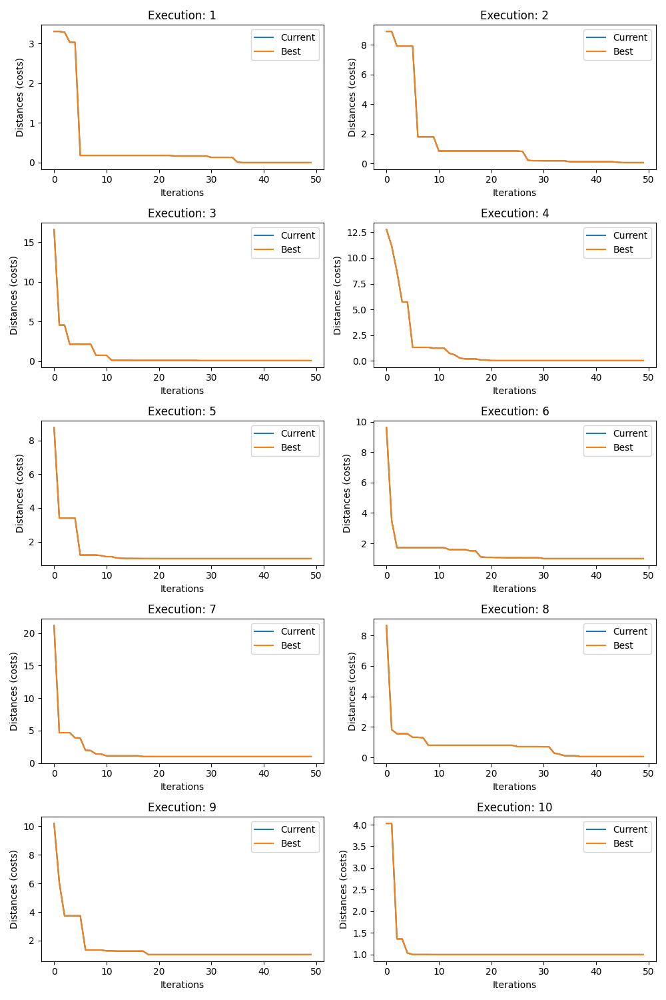

Figure 15: Genetic Algorithm - Evolution of the objective function

  

## Conclusion

This study demonstrates that the **Genetic Algorithm** consistently outperformed the other tested algorithms across both the TSP and Rastrigin function problems. Its ability to explore the solution space broadly through crossover and mutation enabled it to achieve lower median costs and, in some cases, find the optimal solutions. The **classic Hill-Climbing** algorithm struggled with local minima in both problems, while **Hill-Climbing with Restart** and **Simulated Annealing** offered improvements but could not match GA's effectiveness.

These findings underscore the strength of population-based metaheuristics like Genetic Algorithms in tackling complex optimization problems with multiple local minima.

  

## References

1. Western Sahara Dataset. [http://www.math.uwaterloo.ca/tsp/world/wi29.tsp](http://www.math.uwaterloo.ca/tsp/world/wi29.tsp)
2. Map of Points: Visualization of city positions in the Western Sahara dataset. [http://www.math.uwaterloo.ca/tsp/world/wipoints.html](http://www.math.uwaterloo.ca/tsp/world/wipoints.html)
3. Optimal Tour Visualization: Graphical representation of the optimal tour for the Western Sahara dataset. [http://www.math.uwaterloo.ca/tsp/world/uitour.html](http://www.math.uwaterloo.ca/tsp/world/uitour.html)
